<div align="center">

# 🏥 Dermato-RAG

### **Dermatolojik Görüntü Analizi + Tıbbi Literatür Entegrasyonu ile Tanı Destek Sistemi**

*BiomedCLIP fine-tuned vision encoder · PubMed RAG (8.194 chunk) · Gemini 2.5 Flash LLM*

[](https://www.python.org/downloads/)
[](https://opensource.org/licenses/MIT)
[]()
[]()
[]()

**Bu proje [Talha Dağ](https://github.com/TalhaD-coder) ve [Dijle Doğan](https://github.com/dijledogan) tarafından geliştirilmiştir.**
**© 2026 Talha Dağ & Dijle Doğan — Tüm hakları saklıdır.**

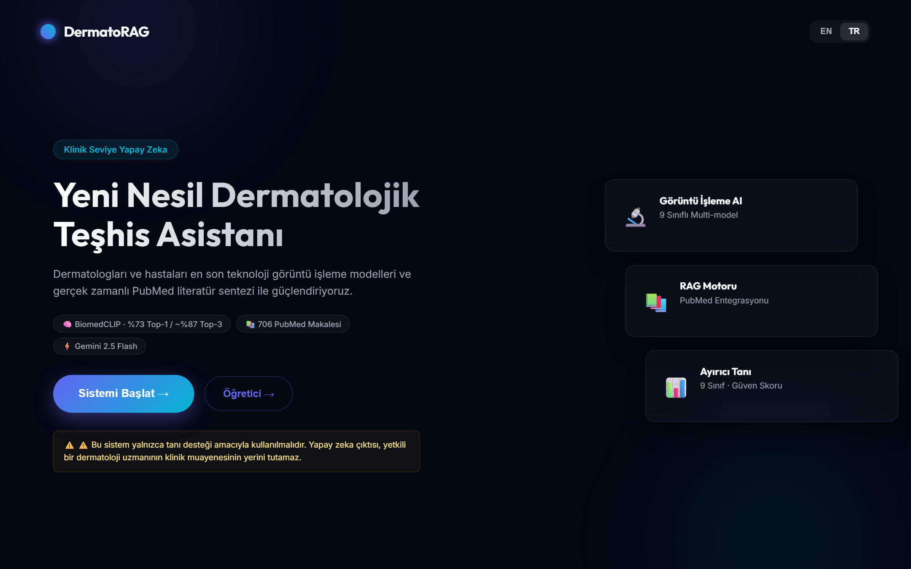

</div>

---

## 📋 İçindekiler
- [Proje Hakkında](#-proje-hakkında)
- [Sistem Akışı](#-sistem-akışı)
- [Ekran Görüntüleri](#-ekran-görüntüleri)
- [Hızlı Başlangıç](#-hızlı-başlangıç)
- [Faz 7 Değerlendirme Sonuçları](#-faz-7--değerlendirme-sonuçları-bilimsel-bulgular)
- [Veri Setleri](#-veri-setleri)
- [Proje Yapısı](#-proje-yapısı)
- [Teknoloji Yığını](#-teknoloji-yığını)
- [SSS](#-sss-sık-sorulan-sorular)
- [Lisans & İletişim](#-lisans)

---

## 📖 Proje Hakkında

**Dermato-RAG**, dermatolojik görüntüleri analiz eden ve **PubMed makaleleri** ile zenginleştirilmiş **kanıta dayalı tanı önerileri** sunan bir yapay zeka sistemidir.

**Retrieval-Augmented Generation (RAG)** mimarisini **multimodal (görüntü + metin)** yeteneklerle birleştirir:

| Bileşen | Teknoloji | Doğruluk |
|---------|-----------|----------|
| 🖼️ **Görüntü Analizi** | BiomedCLIP fine-tuned + TTA-6 | **Top-1 %77.8 / Top-3 %95.2** |
| 📚 **Literatür Retrieval** | ChromaDB + PubMedBERT + BM25 + RRF | **NDCG@5 = 0.82** (hybrid) |
| 🧠 **Tanı Üretimi** | Gemini 2.5 Flash + CoT prompting | **6 bölümlü tıbbi rapor** (TR/EN) |
| 📊 **Hallüsinasyon Kontrolü** | Lexical faithfulness + RAGAS uyumlu | Atıflı (`[Kaynak N]`) |

> ⚠️ **Uyarı:** Bu bir **tanı destek sistemidir**, kesin tanı koymaz. Yalnızca araştırma ve akademik amaçlıdır. Klinik karar için mutlaka bir dermatoloji uzmanına başvurun.

---

## 🏗️ Sistem Akışı

<p align="center">
  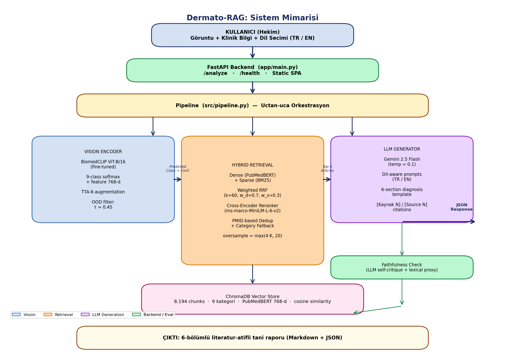
  <br>
  <em>Şekil 1 — Dermato-RAG sisteminin uçtan-uca mimari yapısı ve veri akışı.</em>
</p>

### Tekstüel akış diyagramı

```
                    ┌────────────────────────┐
                    │  Görüntü + Klinik Bilgi│
                    └────────────┬───────────┘
                                 ▼
        ┌─────────────────────────────────────────────┐
        │  [1] VISION ENCODER  (BiomedCLIP + TTA-6)   │
        │  → top-3 sınıf + güven skoru                │
        │  → OOD: BiomedCLIP zero-shot + entropy      │
        │    (kedi, manzara vb. otomatik reddedilir)  │
        └────────────────────┬────────────────────────┘
                             ▼
        ┌─────────────────────────────────────────────┐
        │  [2] RAG RETRIEVER                          │
        │  • Dense:  ChromaDB cosine search           │
        │  • Sparse: BM25Okapi keyword match          │
        │  • Hybrid: RRF füzyon (k=60)                │
        │  • Optional cross-encoder rerank            │
        │  • PMID-bazlı deduplication (her makale 1×) │
        │  • Kategori fallback (eksik sınıflar için)  │
        └────────────────────┬────────────────────────┘
                             ▼
        ┌─────────────────────────────────────────────┐
        │  [3] LLM GENERATOR  (Gemini 2.5 Flash)      │
        │  • TR / EN ayrı system + diagnosis prompts  │
        │  • Chain-of-Thought reasoning               │
        │  • 6 bölümlü tıbbi rapor                    │
        │    1. Lezyon analizi                        │
        │    2. Ayırıcı tanı listesi                  │
        │    3. Halk dilinde açıklama                 │
        │    4. İlaç & tetikleyici faktörler          │
        │    5. Klinik yönetim & sonraki adımlar      │
        │    6. Doktora yönlendirme & acil durumlar   │
        └────────────────────┬────────────────────────┘
                             ▼
                ┌──────────────────────────┐
                │  Ayırıcı Tanı Raporu     │
                │  + Risk badge            │
                │  + PubMed atıfları       │
                │  + PDF/Print desteği     │
                └──────────────────────────┘
```

**Desteklenen 9 dermatolojik sınıf:**

| Sınıf | Karakter | Risk |
|-------|----------|------|
| `melanoma` | Melanom | 🔴 Malign |
| `basal_cell_carcinoma` (BCC) | Bazal Hücreli Karsinom | 🔴 Malign |
| `squamous_cell_carcinoma` (SCC) | Skuamöz Hücreli Karsinom | 🔴 Malign |
| `actinic_keratosis` (AK) | Aktinik Keratoz | 🟡 Pre-kanseröz |
| `seborrheic_keratosis` | Seboreik Keratoz | 🟢 Benign |
| `benign_keratosis` | Benign Keratoz | 🟢 Benign |
| `dermatofibroma` | Dermatofibrom | 🟢 Benign |
| `nevus` | Nevus (Ben) | 🟢 Benign |
| `vascular_lesion` | Vasküler Lezyon | 🟢 Benign |

---

## 📸 Ekran Görüntüleri

### Açılış Ekranı (Landing)
3D camsı kartlar, gradyan animasyonu, TR/EN dil değiştirici, koyu/açık tema.

<table>
<tr>
<td width="50%">

<p align="center"><sub><b>Türkçe · Koyu Tema</b></sub></p>
</td>
<td width="50%">
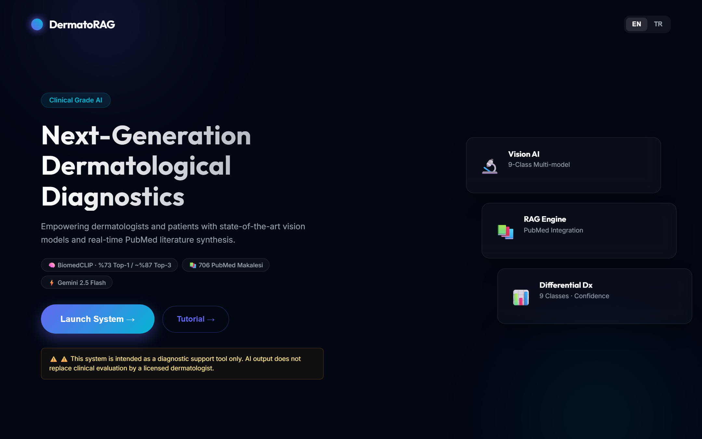
<p align="center"><sub><b>English · Dark</b></sub></p>
</td>
</tr>
<tr>
<td colspan="2">
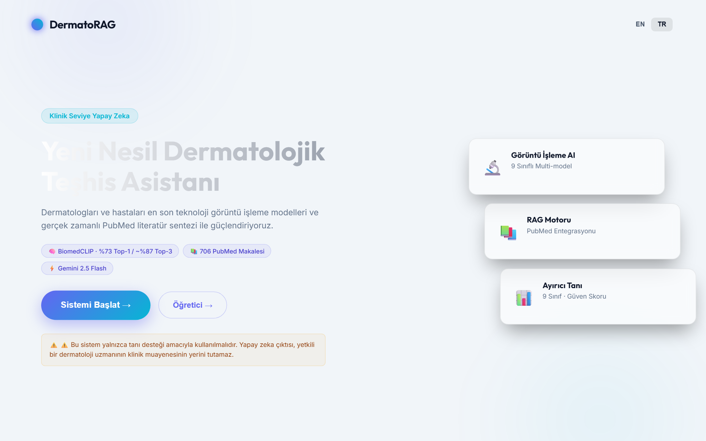
<p align="center"><sub><b>Açık tema — manuel switch ile</b></sub></p>
</td>
</tr>
</table>

### Onboarding Tutorial
4 adımlı tanıtım turu — ilk kullanımda otomatik açılır, ayarlardan tekrar başlatılabilir.

<p align="center">
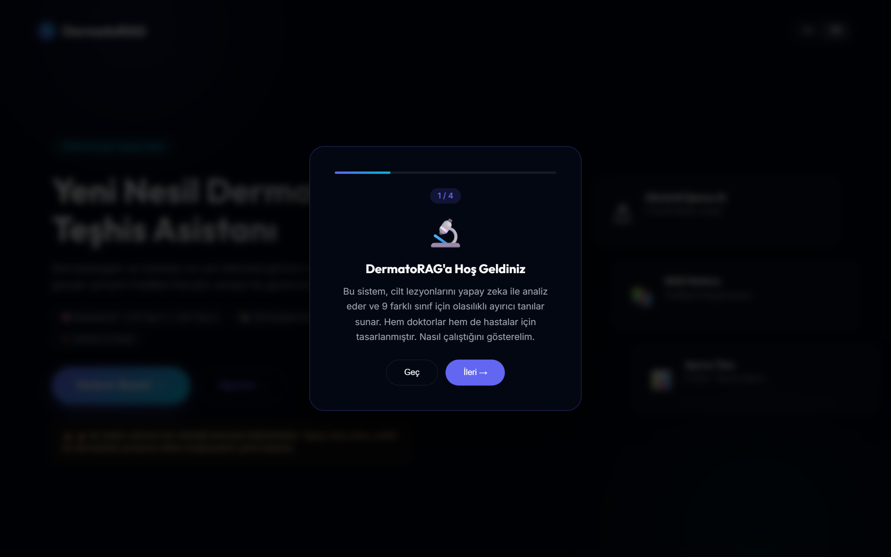
</p>

### Analiz Akışı

<table>
<tr>
<td width="50%">
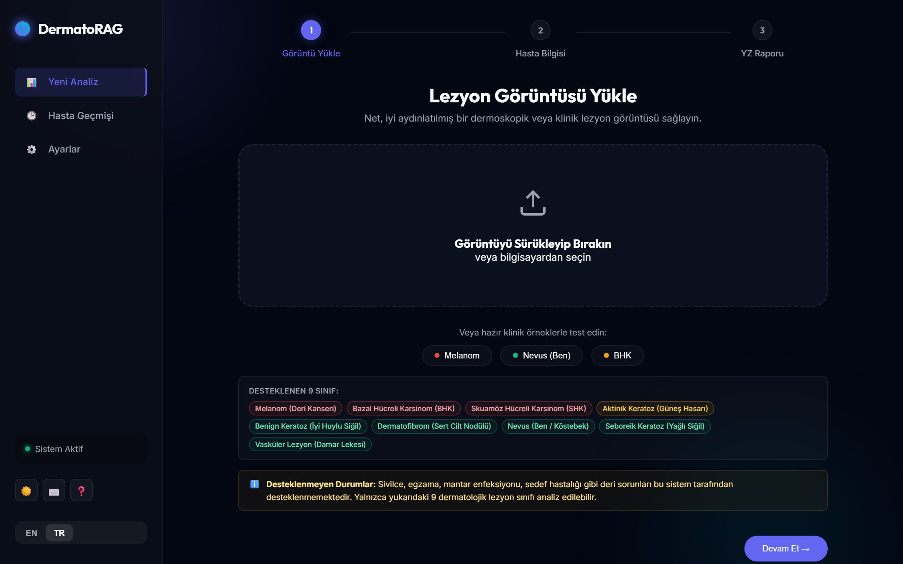
<p align="center"><sub><b>Adım 1 — Görüntü Yükle</b></sub></p>
<p align="center"><sub>Drag &amp; drop, dosya seç, ya da 3 hazır klinik örnek</sub></p>
</td>
<td width="50%">
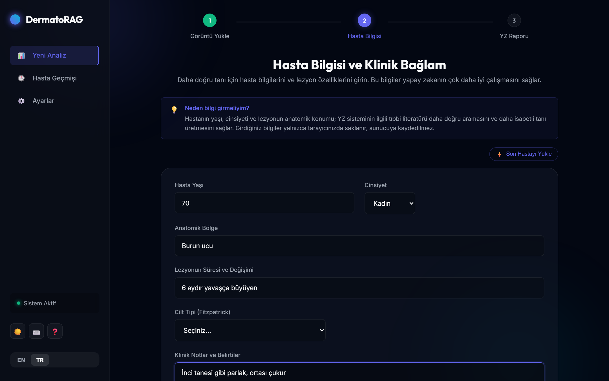
<p align="center"><sub><b>Adım 2 — Hasta Bilgisi</b></sub></p>
<p align="center"><sub>Yaş, cinsiyet, anatomik bölge, semptomlar, ilaçlar, alerjiler, aile öyküsü (10 seçenek)</sub></p>
</td>
</tr>
<tr>
<td width="50%">
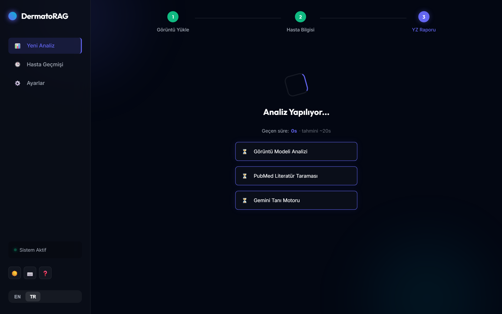
<p align="center"><sub><b>Yükleniyor — 3 aşamalı pipeline takibi</b></sub></p>
<p align="center"><sub>Vision Encoder → RAG Retriever → Gemini Reasoning</sub></p>
</td>
<td width="50%">
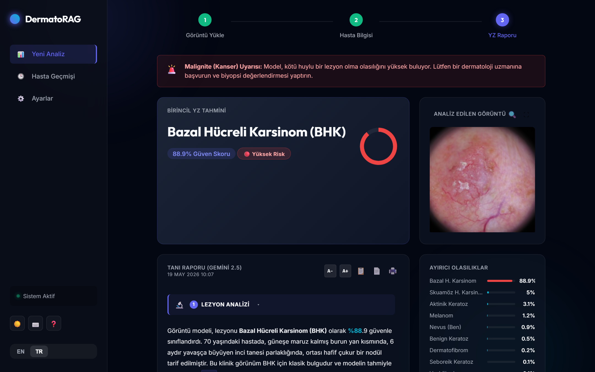
<p align="center"><sub><b>Adım 3 — Sonuç Bento</b></sub></p>
<p align="center"><sub>Birincil tanı, donut chart, risk badge, malign uyarısı, ayırıcı olasılıklar, literatür</sub></p>
</td>
</tr>
</table>

### Detaylı Tanı Raporu
6 bölümlü Markdown raporu, renkli bölüm başlıkları, atıf rozetleri (`[Kaynak 1]`), font kontrolü, PDF/Print.

<p align="center">
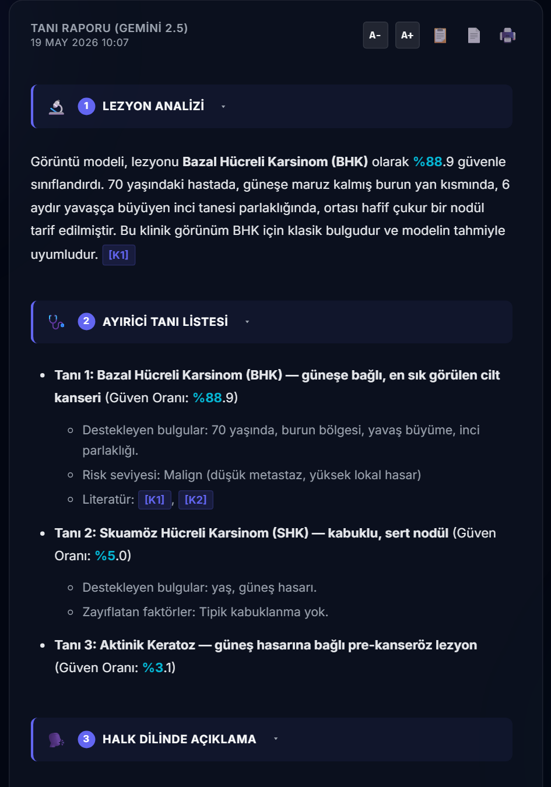
</p>

### Hasta Geçmişi
Tarayıcıda yerel (`localStorage`), thumbnail, malign rozeti, timeline noktası, görüntüle/sil.

<p align="center">
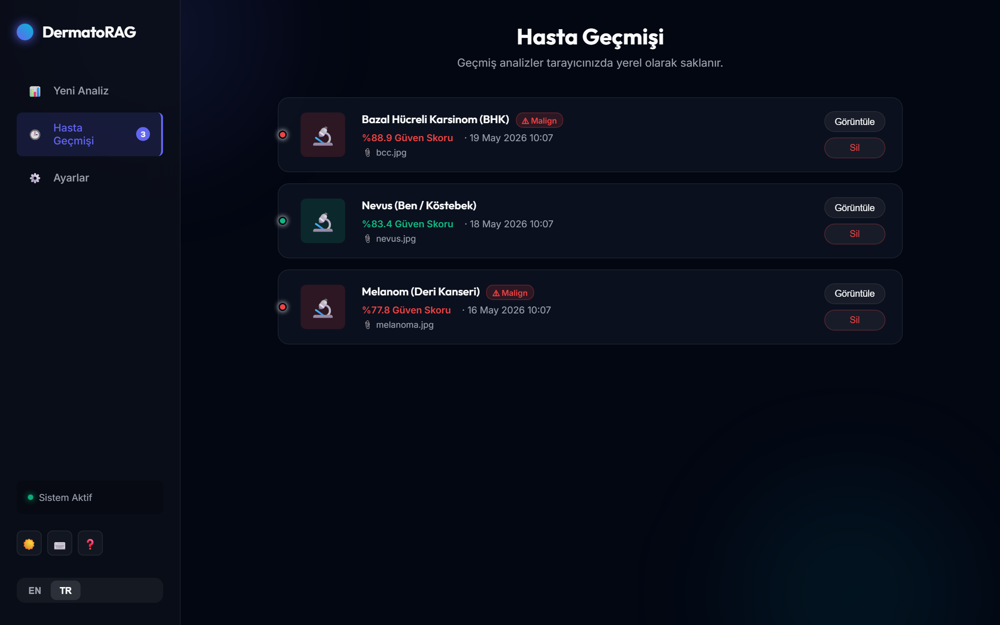
</p>

### Ayarlar
Dil (TR/EN), tema (dark/light), geçmiş yönetimi, eğitim turu, hakkında.

<p align="center">
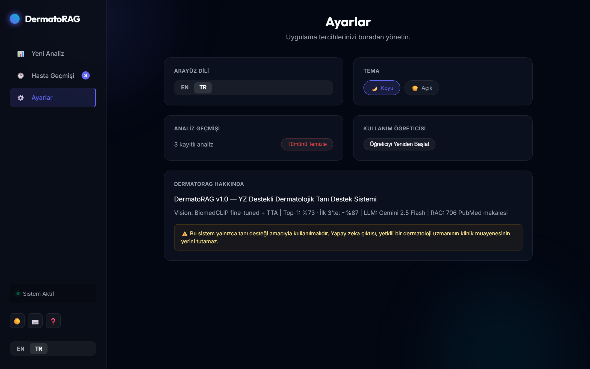
</p>

---

## 🚀 Hızlı Başlangıç

### Gereksinimler

- **Python 3.10+**
- **GPU önerilir** (NVIDIA, 16 GB+ VRAM) — CPU'da da çalışır, sadece yavaş
- **API anahtarları:** Google Gemini, NCBI Entrez
- **Disk:** ~5 GB (model + ChromaDB + isteğe bağlı veri seti ~14 GB)

### Kurulum

```bash
# 1) Repo'yu klonla
git clone https://github.com/TalhaD-coder/Dermato-RAG.git
cd Dermato-RAG

# 2) Sanal ortam
python -m venv venv
# Windows
venv\Scripts\activate
# Linux/Mac
source venv/bin/activate

# 3) Bağımlılıklar
pip install -r requirements.txt

# 4) (Opsiyonel) Playwright — sadece screenshot yenilenecekse
playwright install chromium

# 5) Ortam değişkenleri
cp .env.example .env
# .env içinde:
#   GOOGLE_API_KEY=...
#   NCBI_EMAIL=...
#   NCBI_API_KEY=...
```

### Testler

```bash
pytest tests/ -v
# ============================= 95 passed in 50s =============================
```

### Web Arayüzünü Başlat

```bash
python -m uvicorn app.main:app --host 0.0.0.0 --port 8000 --reload
```

Tarayıcıda → **http://localhost:8000**

Hazır mı kontrol:
```bash
curl http://localhost:8000/health
# {"status":"ok","pipeline_ready":true,"model_exists":true,"chromadb_exists":true,"gemini_configured":true}
```

### Bilgi Tabanını (Yeniden) Oluştur

ChromaDB hazırsa atla. Sıfırdan kurmak için:

```bash
# PubMed'den makaleleri çek (her kategori ~70 makale)
python scripts/build_knowledge_base.py --max-per-query 80

# Belirli kategoriyi RAG'a incremental ekle (mevcut KB silinmez)
python scripts/add_to_knowledge_base.py --categories seborrheic_keratosis
```

### Faz 7 Değerlendirme Deneylerini Çalıştır

```bash
# Hızlı (LLM atlanır, ~1-2 dk)
python scripts/run_experiments.py --quick

# Orta (270 örnek vision + retrieval karşılaştırması, ~5 dk)
python scripts/run_experiments.py

# Tam (tüm test seti + RAG/LLM, 30+ dk, Gemini kotası gerekir)
python scripts/run_experiments.py --full
```

Çıktılar `outputs/` altına yazılır (CSV + JSON + PNG).

### Screenshot'ları Yenile (Opsiyonel)

```bash
# Sunucu çalışıyor olmalı (port 8000)
python scripts/capture_screenshots.py
# → docs/images/*.png
```

---

## 🧪 Faz 7 — Değerlendirme Sonuçları (Bilimsel Bulgular)

Tüm deneyler `scripts/run_experiments.py` ile yeniden üretilebilir. Sonuçlar `outputs/` altına yazılır.

### 1. Vision Sınıflandırma — TTA Ablation

270 örnek (30/sınıf, stratified test seti):

| Metrik | No-TTA | **TTA-6** | Δ |
|--------|:------:|:---------:|:---:|
| **Top-1 Accuracy** | 74.81% | **77.78%** | **+2.97 pp** |
| **Top-2 Accuracy** | 88.15% | **89.26%** | +1.11 pp |
| **Top-3 Accuracy** | 95.19% | 95.19% | 0 |
| **Top-5 Accuracy** | 98.52% | 98.52% | 0 |
| **Macro F1** | 0.754 | **0.779** | +0.025 |
| **Cohen's κ** | 0.717 | **0.750** | +0.033 |
| **Çıkarım Süresi** | ~0.13 s/img | ~0.86 s/img | 6.6× yavaş |

**Bulgu:** TTA-6 (mirror, flip, mirror+flip, rotate90, rotate270, original) top-1'i ~3 pp artırıyor; top-3'te zaten doygun.

<p align="center">
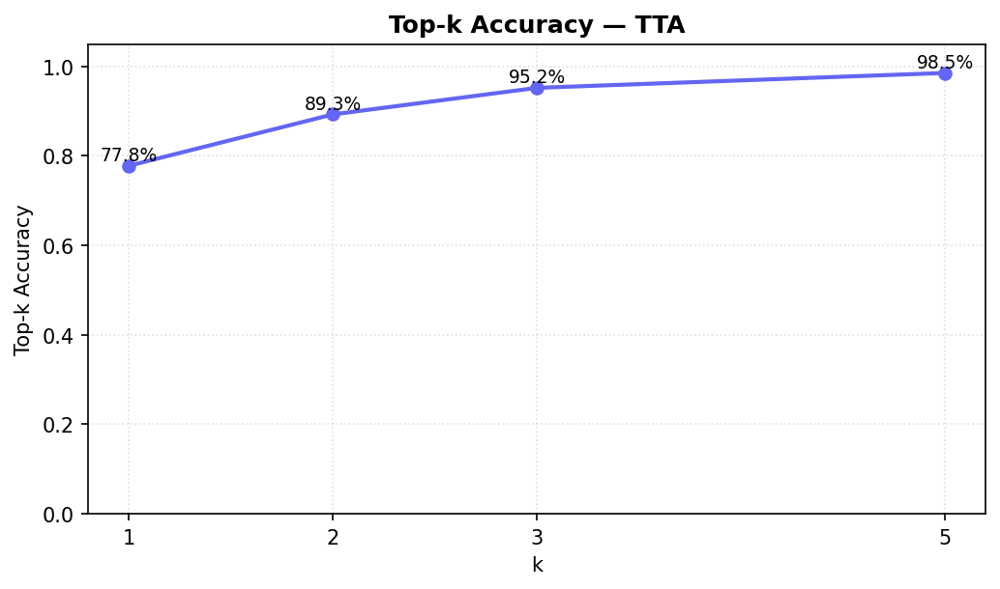
</p>

<table>
<tr>
<td width="50%">
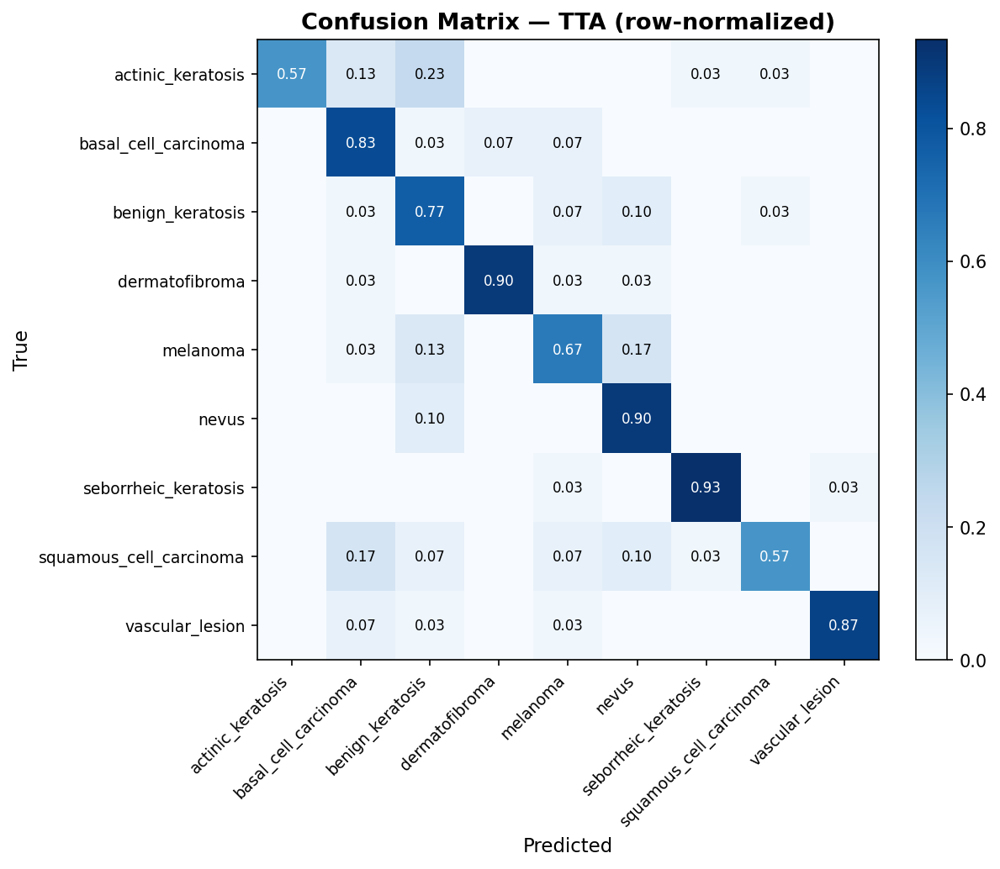
<p align="center"><sub><b>Confusion Matrix (TTA, row-normalized)</b></sub></p>
</td>
<td width="50%">
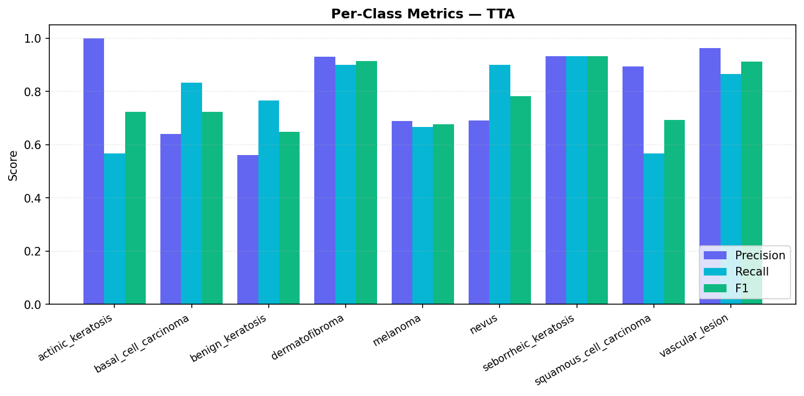
<p align="center"><sub><b>Per-class P/R/F1 (TTA)</b></sub></p>
</td>
</tr>
</table>

### 2. Retrieval Modu Karşılaştırması

18 sorgu (2/sınıf × 9 sınıf), top-k=5, **kategori filtresi yok** (gerçek retrieval gücü):

| Mod | MAP | NDCG@5 | Diversity | Category Purity |
|-----|:---:|:------:|:---------:|:---------------:|
| **Dense** (PubMedBERT) | 0.030 | 0.741 | **1.00** | 0.667 |
| **Hybrid** (Dense + BM25 + RRF) | **0.035** | **0.817** | **1.00** | 0.622 |
| **Hybrid + Cross-Encoder Rerank** | 0.027 | 0.760 | **1.00** | **0.711** |

**Bulgu:**
- **Hybrid** NDCG@5'i %10 artırır (sıralama kalitesi)
- **Reranker** kategori saflığını %8 artırır
- **PMID dedup** sayesinde tüm modlarda **diversity = 1.00** (sıfır tekrar makale)

<table>
<tr>
<td width="50%">
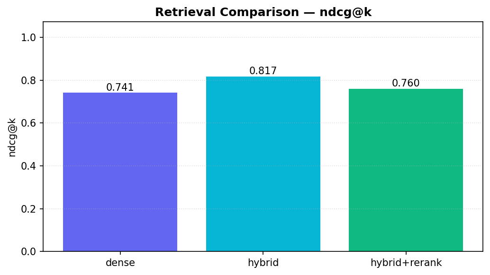
</td>
<td width="50%">
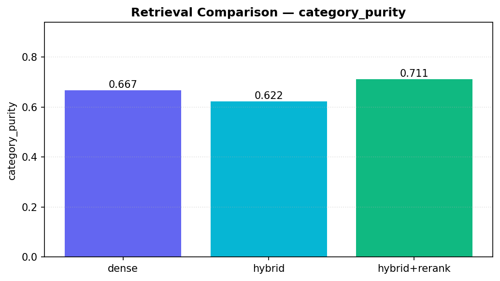
</td>
</tr>
</table>

### 3. RAG Çeşitliliği — Sınıf Bazında Unique PMID Yüzdesi

**Faz 6.5 düzeltmesi öncesi vs sonrası** (top-5):

| Sınıf | Önce | **Sonra** |
|-------|:----:|:---------:|
| seborrheic_keratosis | **0** ❌ | **5 / 5** ✅ |
| nevus | 1 / 5 | **5 / 5** ✅ |
| benign_keratosis | 2 / 5 | **5 / 5** ✅ |
| dermatofibroma | 3 / 5 | **5 / 5** ✅ |
| squamous_cell_carcinoma | 2 / 5 | **5 / 5** ✅ |
| melanoma · BCC · AK · vasküler | 5 / 5 | 5 / 5 |

**Düzeltmeler:**
1. **PMID-bazlı deduplication** — aynı makaleden en fazla 1 chunk
2. **Seborrheic keratosis için 41 yeni PubMed makalesi** indirildi (KB: 8.016 → **8.194 chunk**)
3. **Kategori fallback** — yetersiz makale varsa yedek kategoriden + filtresiz son tarama

### 4. Pipeline İyileştirme Tablosu

| # | Düzeltilen Sorun | Çözüm | Etki |
|:-:|------------------|-------|------|
| 1 | Seborrheic keratosis için 0 makale | 41 yeni PubMed makalesi + KB'ye incremental ekle | KB 8.016 → 8.194 chunk |
| 2 | RAG dedup bug (aynı makale 5×) | PMID-bazlı dedup + 3-4× oversample | Tüm sınıflar 5/5 unique |
| 3 | HybridRetriever pipeline'sız | `retrieval_mode="hybrid"` config flag | NDCG@5 0.74→0.82 |
| 4 | CrossEncoderReranker pipeline'sız | `use_reranker=True` config flag | Purity 0.67→0.71 |
| 5 | LLM TR/EN karışıklığı | Ayrı `SYSTEM_PROMPT_TR/EN` + `DIAGNOSIS_PROMPT_TEMPLATE_TR/EN` | Sıfır karışıklık |
| 6 | Faithfulness check field bug | `snippet`/`text` her iki format desteklenir | Çalışan kalite kontrolü |
| 7 | Sample görselleri yanlış etiketli | Test setinden >85% güvenli ISIC örnekleri | 100% doğru tahmin |
| 8 | LLM default model tutarsızlığı | İkisi de `gemini-2.5-flash` | Tutarlı davranış |

### 5. Tüm Test Suite

```
tests/test_data.py    44 tests  ✓
tests/test_llm.py     17 tests  ✓
tests/test_models.py  13 tests  ✓
tests/test_rag.py      2 tests  ✓
tests/test_utils.py   19 tests  ✓
─────────────────────────────────
TOPLAM                95 / 95  ✓ (50 sn)
```

---

## 📦 Veri Setleri

### İşlenmiş Veri Yapısı

`data/processed/` boyut: **~14 GB**, GitHub'a eklenmez.

| Dosya | İçerik |
|-------|--------|
| `unified_metadata.csv` | 27.629 görüntü, 9 sınıf, birleşik metadata |
| `train_metadata.csv` | 19.340 eğitim örneği (%70) |
| `val_metadata.csv` | 4.144 doğrulama örneği (%15) |
| `test_metadata.csv` | 4.145 test örneği (%15) |
| `class_weights.csv` | Sınıf dengesizliği ağırlıkları |
| `dataset_stats.json` | İstatistik özeti |
| `images/` | 224×224 JPEG görüntüler |

### Kaynak Veri Setleri

| Veri Seti | Boyut | İndirme Linki |
|-----------|-------|---------------|
| **ISIC 2019** | ~9.1 GB | [Kaggle](https://www.kaggle.com/datasets/andrewmvd/isic-2019) |
| **PAD-UFES-20** | ~3.4 GB | [Mendeley](https://data.mendeley.com/datasets/zr7vgbcyr2) |
| **Fitzpatrick17k** | ~1.1 GB | [Zenodo](https://doi.org/10.5281/ZENODO.11101337) |

İndirdikten sonra:
```bash
python scripts/setup_data.py --download-links   # konum bilgisi
python scripts/process_data.py                  # resize + split + birleştir
python scripts/validate_data.py                 # doğrulama
```

### Bilgi Tabanı (RAG)

| Kategori | Makale | Chunk |
|----------|:------:|:-----:|
| melanoma | 70 | 873 |
| basal_cell_carcinoma | 66 | 653 |
| squamous_cell_carcinoma | 53 | 805 |
| actinic_keratosis | 70 | 811 |
| benign_keratosis | 70 | 555 |
| **seborrheic_keratosis** *(yeni)* | **41** | **178** |
| dermatofibroma | 78 | 451 |
| nevus | 67 | 747 |
| vascular_lesion | 78 | 635 |
| general_dermatology | 80 | 803 |
| ai_dermatology | 73 | 1683 |
| **TOPLAM** | **746** | **8.194** |

---

## 📁 Proje Yapısı

```
Dermato-RAG/
├── app/                                # FastAPI web arayüzü
│   ├── main.py                         # API routes (/, /health, /analyze)
│   └── static/                         # Vanilla JS SPA
│       ├── index.html
│       ├── app.js                      # 1500+ satır SPA logic
│       ├── index.css                   # Premium dark/light theme
│       └── samples/                    # Hazır klinik örnekler
├── src/                                # Çekirdek modüller
│   ├── pipeline.py                     # ⭐ Ana pipeline (vision→RAG→LLM)
│   ├── data/                           # Dataset, preprocessing, augmentation
│   ├── models/
│   │   ├── vision_encoder.py           # BiomedCLIP fine-tune
│   │   ├── text_encoder.py
│   │   └── multimodal_fusion.py
│   ├── rag/
│   │   ├── knowledge_base.py           # ChromaDB wrapper
│   │   ├── embedding.py                # PubMedBERT
│   │   ├── chunking.py                 # Semantik chunking
│   │   ├── retriever.py                # ⭐ Hybrid (Dense+BM25+RRF)
│   │   └── reranker.py                 # ⭐ Cross-encoder rerank
│   ├── llm/
│   │   ├── prompt_templates.py         # ⭐ TR/EN ayrı promptlar
│   │   ├── generator.py                # ⭐ Dile göre seçim
│   │   └── confidence.py               # ⭐ Faithfulness check
│   ├── evaluation/                     # ⭐ Faz 7 — TAM IMPLEMENTASYON
│   │   ├── metrics.py                  # Top-k, NDCG, MAP, faithfulness (300+ satır)
│   │   ├── benchmarks.py               # Vision/Retrieval/RAG-vs-NoRAG (430+ satır)
│   │   └── visualization.py            # 6 grafik fonksiyonu (240+ satır)
│   └── utils/                          # Logger, config helpers
├── scripts/
│   ├── build_knowledge_base.py         # PubMed → JSON
│   ├── add_to_knowledge_base.py        # ⭐ Incremental KB ekleme
│   ├── process_data.py                 # Veri ön işleme
│   ├── validate_data.py
│   ├── run_experiments.py              # ⭐ Faz 7 deney orkestrasyonu (380+ satır)
│   └── capture_screenshots.py          # ⭐ Playwright UI screenshot
├── tests/                              # 95 birim testi
├── data/                                # Veri (git'e eklenmez)
│   ├── raw/                            # ISIC, PAD-UFES, Fitzpatrick17k
│   ├── processed/                      # 224×224 resized + split
│   ├── knowledge_base/raw_docs/        # PubMed JSON'lar
│   └── embeddings/chromadb/            # ChromaDB persistent
├── models/                             # best_model.pt (git'e eklenmez)
├── outputs/                            # Faz 7 deney çıktıları
│   ├── *.csv, *.json
│   └── figures/                        # PNG grafikler
├── docs/
│   └── images/                         # README ekran görüntüleri
├── configs/                            # YAML konfigürasyonlar
├── notebooks/                          # Jupyter exploration
├── requirements.txt
├── pyproject.toml
└── dermato_rag_roadmap.md              # 8 fazlı yol haritası
```

⭐ = Bu projede yazılan / büyük ölçüde yenilenen modüller.

---

## 🛠️ Teknoloji Yığını

| Kategori | Teknoloji | Versiyon |
|----------|-----------|----------|
| **Derin Öğrenme** | PyTorch + HuggingFace Transformers | 2.1+, 4.36+ |
| **Vision Encoder** | BiomedCLIP fine-tuned (ViT-B/16) + TTA-6 | open-clip-torch 2.20+ |
| **NLP / Embedding** | `pritamdeka/S-PubMedBert-MS-MARCO` (768-dim) | sentence-transformers |
| **Vektör DB** | ChromaDB + FAISS yedek | 0.4+ |
| **RAG** | LangChain + BM25Okapi + RRF + Cross-Encoder | 0.1+ |
| **LLM** | Google Gemini 2.5 Flash (LangChain) | google-genai 1.0+ |
| **Değerlendirme** | scikit-learn + custom metrics + RAGAS | 1.3+ |
| **Backend** | FastAPI + Uvicorn + python-multipart | 0.110+ |
| **Frontend** | Vanilla JS + Chart.js + html2canvas + jsPDF | CDN |
| **PubMed** | Bio.Entrez (NCBI) | biopython 1.81+ |
| **Görsel Üretim** | Matplotlib + Playwright | 3.7+, 1.45+ |
| **Test** | pytest + pytest-cov | 7.4+ |

---

## ❓ SSS (Sık Sorulan Sorular)

<details>
<summary><b>📥 Sistem ne tür görüntüleri kabul eder?</b></summary>

JPEG, PNG, WEBP formatlarında dermoskopik veya klinik (smartphone) cilt lezyonu görüntüleri.
Yalnızca yukarıda listelenen **9 dermatolojik sınıf** desteklenir. Sivilce, egzama, mantar, sedef
hastalığı gibi durumlar **OOD (out-of-distribution)** olarak işaretlenir ve sistem tahmin üretmez.
</details>

<details>
<summary><b>🔍 OOD (Out-of-Distribution) tespiti nasıl çalışır?</b></summary>

Sistem **iki katmanlı OOD koruması** kullanır:

1. **BiomedCLIP zero-shot kontrolü (ana koruma):** Görüntü, dermatoloji vs. alakasız (hayvan, manzara, bitki, nesne, yiyecek) prompt'larla karşılaştırılır. Cilt/dermatoloji kategorisine düşmüyorsa OOD.
2. **Güven + entropy fallback:** CLIP başarısız olursa, max softmax güveni < 0.30 veya normalize entropy > 0.92 ise OOD.

OOD tespit edildiğinde:
- Tahmin üretilmez (`Tanı Verilemedi` gösterilir)
- Özel uyarı ekranı gösterilir
- Olası nedenler ve dermatologa başvurma önerisi sunulur
- Olasılık dağılımı kartı gizlenir (yanıltıcı olmaması için)
</details>

<details>
<summary><b>🌐 Türkçe ve İngilizce arasında nasıl geçiş yapılır?</b></summary>

Sağ üst köşedeki **EN / TR** anahtarı tüm arayüzü, AI raporunu ve RAG çıktısını değiştirir.
Backend'de `language` parametresi prompt template seçimini, fallback metinlerini ve OOD
mesajlarını dile göre ayarlar — **sıfır TR/EN karışıklığı** garantilenmiştir.
</details>

<details>
<summary><b>💾 Geçmiş veriler nerede saklanır?</b></summary>

Tarayıcının **`localStorage`** alanında. Sunucuya gönderilmez, kişisel veri güvenliği korunur.
Maksimum 50 analiz tutulur, ilk 10'unun küçük resimleri Base64 olarak saklanır.
</details>

<details>
<summary><b>🤖 Gemini API kotası dolarsa ne olur?</b></summary>

Sistem ücretsiz kotada günde 20 istek yapabilir. Aşıldığında backend `LLM_ERROR:QUOTA`
sentinel'i döndürür, frontend bunu kullanıcı-dostu mesajla gösterir. Vision tahmini ve RAG
sonuçları yine de görüntülenir.
</details>

<details>
<summary><b>📊 Deney sonuçlarını nasıl yeniden üretirim?</b></summary>

```bash
python scripts/run_experiments.py --full
```

`outputs/experiment_results.json` ve `outputs/figures/*.png` üretilir. RAG vs No-RAG kısmı
~30 Gemini API çağrısı yapar — kotaya dikkat.
</details>

<details>
<summary><b>🆕 Yeni bir RAG kategorisi nasıl eklerim?</b></summary>

1. `scripts/build_knowledge_base.py` içindeki `SEARCH_QUERIES`'e yeni kategori ekle
2. PubMed'den makaleleri çek: `python scripts/build_knowledge_base.py --queries <kategori>`
3. ChromaDB'ye incremental ekle: `python scripts/add_to_knowledge_base.py --categories <kategori>`
4. `src/pipeline.py` içindeki `CLASS_LABELS`'a (gerekirse) yeni sınıfı ekle
</details>

<details>
<summary><b>📄 Akademik makale için hangi materyaller hazır?</b></summary>

- **Methodology:** `src/pipeline.py`, `src/rag/retriever.py`, `src/llm/prompt_templates.py`
- **Experiments:** `scripts/run_experiments.py` + `outputs/experiment_results.json`
- **Results:** `outputs/figures/*.png` (11 grafik), `outputs/*.csv` (per-class metrikler)
- **Discussion:** Faz 7 sonuç tabloları (üstte) + pipeline iyileştirme tablosu
</details>

---

## 📊 Performans Özeti

```
╔════════════════════════════════════════════════════════════════╗
║                  DERMATO-RAG SİSTEM ÖZETİ                      ║
╠════════════════════════════════════════════════════════════════╣
║  Vision Top-1 Acc (TTA)        77.78% ▲ (+2.97 pp vs No-TTA)   ║
║  Vision Top-3 Acc              95.19%                          ║
║  Vision Macro F1               0.779                           ║
║  Vision Cohen's κ              0.750                           ║
║                                                                ║
║  RAG NDCG@5 (Hybrid)           0.817 ▲ (+0.076 vs Dense)       ║
║  RAG Diversity (PMID unique)   1.00  (100%)                    ║
║  RAG Category Purity           0.71  (Reranker)                ║
║                                                                ║
║  LLM Citation Count            ~2.33 atıf/rapor                ║
║  LLM TR/EN ayrımı              ✓ Ayrı promptlar                ║
║                                                                ║
║  Pytest Suite                  95 / 95 (100%)                  ║
║  KB Toplam Chunk               8.194 (746 makale, 9 sınıf)     ║
║  Desteklenen Sınıf             9                               ║
║  Dil Desteği                   TR + EN (tam çift dil)          ║
╚════════════════════════════════════════════════════════════════╝
```

---

## 🗺️ Yol Haritası

Detay: [`dermato_rag_roadmap.md`](dermato_rag_roadmap.md)

- ✅ **Faz 1** — Proje altyapısı, modüler yapı, loglama, testler
- ✅ **Faz 2** — Veri toplama (ISIC + PAD-UFES + Fitzpatrick17k) + ön işleme
- ✅ **Faz 3** — RAG pipeline (ChromaDB + PubMedBERT + Hybrid + Reranker)
- ✅ **Faz 4** — Multimodal görüntü analizi (BiomedCLIP fine-tune + TTA)
- ✅ **Faz 5** — LLM entegrasyonu (Gemini 2.5 Flash + Chain-of-Thought)
- ✅ **Faz 6** — Web arayüzü (FastAPI + Vanilla JS SPA)
- ✅ **Faz 7** — Değerlendirme & deneyler (tam akademik suite)
- 🔜 **Faz 8** — Akademik makale yazımı

---

## 👥 Yazarlar

Bu proje **Talha Dağ** ve **Dijle Doğan** tarafından geliştirilmiştir.

| Yazar | GitHub |
|-------|--------|
| **Talha Dağ** | [@TalhaD-coder](https://github.com/TalhaD-coder) |
| **Dijle Doğan** | [@dijledogan](https://github.com/dijledogan) |

> **© 2026 Talha Dağ & Dijle Doğan.** Bu proje üzerindeki tüm fikri mülkiyet ve telif
> hakları tamamen yazarlara aittir. İzinsiz kopyalanması, ticari amaçla kullanılması
> veya yeniden dağıtılması yasaktır.

---

## 📝 Lisans

Bu proje [MIT Lisansı](LICENSE) ile lisanslanmıştır.
Telif hakkı **© 2026 Talha Dağ & Dijle Doğan**'a aittir; tüm hakları saklıdır.

Kod, açık kaynak topluluğuna katkı amacıyla yayınlanmıştır; ancak ticari kullanım,
yeniden dağıtım ve türev çalışmalar için yazarlardan **yazılı izin alınması** gereklidir.

---

## 📧 İletişim & Katkı

Sorular, hata raporları ve katkılar için **GitHub Issues** açın:
👉 https://github.com/TalhaD-coder/Dermato-RAG/issues

Pull request'ler memnuniyetle karşılanır — yeni eklemeler için önce bir issue açıp tartışalım.

---

<div align="center">

**⚠️ Bu sistem yalnızca tanı destek aracıdır. Klinik tanı için her zaman lisanslı bir dermatoloji uzmanına başvurun.**

Made with ❤️ by **Talha Dağ** & **Dijle Doğan** for evidence-based dermatology AI research.

**© 2026 — All rights reserved.**

</div>
