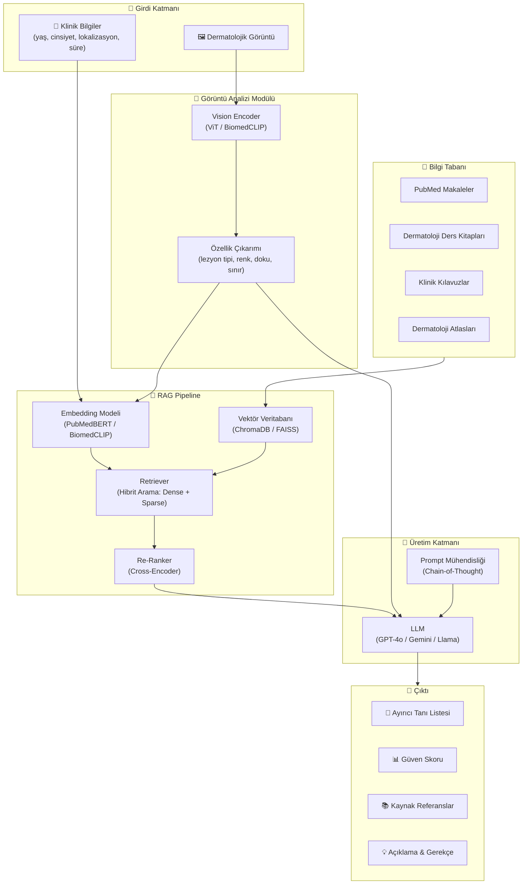

# 🏥 Dermato-RAG: Yol Haritası ve Mimari Plan

> **Dermatoloji Multimodal Görüntü Analizi ve Tıbbi Literatür Entegrasyonu ile Tanı Destek Sistemi**

---

## 📋 Proje Özeti

Dermato-RAG, dermatolojik görüntüleri analiz eden ve tıbbi literatürü (PubMed, dermatoloji kitapları, kılavuzlar) entegre ederek **kanıta dayalı tanı önerileri** sunan bir yapay zeka sistemidir. Sistem, **Retrieval-Augmented Generation (RAG)** mimarisini **multimodal (görüntü + metin)** yeteneklerle birleştirerek çalışır.

---

## 🏗️ Sistem Mimarisi (Üst Düzey)



---

## 📅 Proje Fazları

### **Faz 1: Proje Altyapısı ve Ortam Kurulumu** ⏱️ ~1 hafta
| Görev | Detay |
|-------|-------|
| Proje yapısı oluşturma | Modüler Python paketi yapısı |
| Sanal ortam & bağımlılıklar | `requirements.txt`, `pyproject.toml` |
| Konfigürasyon yönetimi | YAML tabanlı config sistemi |
| Loglama altyapısı | Yapılandırılmış loglama |
| Git & versiyon kontrolü | `.gitignore`, branch stratejisi |
| Temel testler | pytest altyapısı |

### **Faz 2: Veri Toplama ve Hazırlama** ⏱️ ~2-3 hafta

#### 2a. Dermatolojik Görüntü Veri Setleri
| Veri Seti | Açıklama | Boyut |
|-----------|----------|-------|
| **ISIC Archive** | Melanom ve cilt lezyonları | ~70K görüntü |
| **Dermnet** | Çeşitli dermatolojik durumlar | ~23K görüntü |
| **Fitzpatrick17k** | Cilt tonu çeşitliliği ile etiketli | ~17K görüntü |
| **HAM10000** | 7 kategori pigmentli lezyon | ~10K görüntü |
| **SD-198** | 198 cilt hastalığı | ~6.5K görüntü |
| **PAD-UFES-20** | Akıllı telefon görüntüleri | ~2.3K görüntü |

#### 2b. Tıbbi Literatür (RAG Bilgi Tabanı)
| Kaynak | Yöntem |
|--------|--------|
| **PubMed/PMC** | Entrez API ile dermatoloji makaleleri |
| **Dermatoloji Ders Kitapları** | Fitzpatrick's Dermatology, Andrews' Diseases |
| **Klinik Kılavuzlar** | AAD, BAD, WHO kılavuzları |
| **DermIS / DermAtlas** | Açık erişimli dermatoloji atlasları |

#### 2c. Veri İşleme
- Görüntü ön işleme (yeniden boyutlandırma, normalizasyon, augmentation)
- Metin temizleme ve yapılandırma (chunk'lama stratejisi)
- Metadata çıkarımı (hastalık adı, ICD-10 kodu, vücut bölgesi)
- Train/Validation/Test split (%70/%15/%15)

### **Faz 3: Bilgi Tabanı ve RAG Pipeline** ⏱️ ~2-3 hafta
| Görev | Detay |
|-------|-------|
| **Chunk Stratejisi** | Semantik chunking (başlık bazlı + örtüşmeli) |
| **Embedding Modeli** | `BiomedCLIP` (multimodal) + `PubMedBERT` (metin) |
| **Vektör DB** | ChromaDB (geliştirme) / FAISS (üretim) |
| **Hibrit Arama** | Dense (embedding) + Sparse (BM25) birleşimi |
| **Re-Ranking** | Cross-encoder ile sonuç kalitesini artırma |
| **Metadata Filtreleme** | Hastalık kategorisi, yayın yılı, kanıt düzeyi |

### **Faz 4: Multimodal Görüntü Analizi** ⏱️ ~2-3 hafta
| Görev | Detay |
|-------|-------|
| **Vision Encoder** | BiomedCLIP / ViT-B/16 fine-tuning |
| **Özellik Çıkarımı** | Lezyon segmentasyonu, renk analizi, doku analizi |
| **Sınıflandırma** | Multi-label dermatolojik sınıflandırma |
| **Multimodal Füzyon** | Görüntü + metin özelliklerinin birleştirilmesi |
| **Görüntü-Metin Eşleştirme** | Görüntüyü ilgili literatürle eşleştirme |

### **Faz 5: LLM Entegrasyonu ve Prompt Mühendisliği** ⏱️ ~2 hafta
| Görev | Detay |
|-------|-------|
| **LLM Seçimi** | GPT-4o / Gemini Pro / Llama 3 karşılaştırma |
| **Prompt Tasarımı** | Chain-of-Thought dermatoloji promptları |
| **Kontekst Penceresi** | Retrieval sonuçları + görüntü özellikleri birleştirme |
| **Güven Skoru** | Model belirsizliği ve güven hesaplama |
| **Hallüsinasyon Kontrolü** | Kaynak doğrulama ve çapraz kontrol |

### **Faz 6: Web Arayüzü (Demo)** ⏱️ ~1-2 hafta
| Görev | Detay |
|-------|-------|
| **Frontend** | Streamlit veya Gradio tabanlı arayüz |
| **Görüntü Yükleme** | Drag & drop görüntü yükleme |
| **Klinik Form** | Hasta bilgileri giriş formu |
| **Sonuç Gösterimi** | Tanı listesi, güven skoru, referanslar |
| **Görselleştirme** | Attention haritaları, lezyon segmentasyonu |

### **Faz 7: Değerlendirme ve Deneyler** ⏱️ ~2-3 hafta
| Metrik | Açıklama |
|--------|----------|
| **Top-k Accuracy** | İlk k tanı içinde doğru tanı oranı |
| **Precision / Recall / F1** | Sınıflandırma metrikleri |
| **NDCG** | Retrieval kalitesi |
| **Faithfulness** | Üretilen metnin kaynağa sadakati |
| **Clinical Relevance** | Klinik uzman değerlendirmesi |
| **Ablation Study** | Her modülün katkısının analizi |

#### Karşılaştırma Deneyleri
1. **RAG vs No-RAG**: Literatür entegrasyonunun etkisi
2. **Multimodal vs Text-only**: Görüntü analizinin katkısı
3. **Farklı LLM'ler**: GPT-4o vs Gemini vs açık kaynak modeller
4. **Farklı Retrieval Stratejileri**: Dense vs Sparse vs Hybrid
5. **Farklı Chunk Boyutları**: Optimal chunk boyutu analizi

### **Faz 8: Makale Yazımı** ⏱️ ~3-4 hafta
| Bölüm | İçerik |
|-------|--------|
| **Abstract** | Özet ve temel bulgular |
| **Introduction** | Problem tanımı, motivasyon, katkılar |
| **Related Work** | Dermatoloji AI, RAG sistemleri, multimodal modeller |
| **Methodology** | Sistem mimarisi, her modülün detaylı açıklaması |
| **Experiments** | Veri setleri, metrikler, deney düzeni |
| **Results** | Tablolar, grafikler, karşılaştırmalar |
| **Discussion** | Bulgular, limitasyonlar, klinik implikasyonlar |
| **Conclusion** | Sonuç ve gelecek çalışmalar |

---

## 🛠️ Teknoloji Yığını

| Kategori | Teknoloji |
|----------|-----------|
| **Dil** | Python 3.10+ |
| **Derin Öğrenme** | PyTorch, HuggingFace Transformers |
| **Vision** | torchvision, BiomedCLIP, timm |
| **NLP / Embedding** | sentence-transformers, PubMedBERT |
| **RAG Framework** | LangChain / LlamaIndex |
| **Vektör DB** | ChromaDB, FAISS |
| **LLM API** | OpenAI API, Google Gemini API |
| **Veri İşleme** | pandas, numpy, Pillow, OpenCV |
| **Değerlendirme** | scikit-learn, RAGAS |
| **Arayüz** | Gradio / Streamlit |
| **Deney Takibi** | Weights & Biases (wandb) |
| **Versiyon Kontrolü** | Git, GitHub |

---

## 📁 Önerilen Proje Yapısı

```
Dermato-RAG/
├── configs/                    # Konfigürasyon dosyaları
│   ├── config.yaml
│   ├── model_config.yaml
│   └── data_config.yaml
├── data/                       # Veri dizini (git'e eklenmez)
│   ├── raw/                    # Ham veriler
│   ├── processed/              # İşlenmiş veriler
│   ├── knowledge_base/         # RAG bilgi tabanı dokümanları
│   └── embeddings/             # Önceden hesaplanmış embedding'ler
├── src/                        # Ana kaynak kodu
│   ├── __init__.py
│   ├── data/                   # Veri yükleme ve işleme
│   │   ├── __init__.py
│   │   ├── dataset.py
│   │   ├── preprocessing.py
│   │   └── augmentation.py
│   ├── models/                 # Model tanımları
│   │   ├── __init__.py
│   │   ├── vision_encoder.py
│   │   ├── text_encoder.py
│   │   └── multimodal_fusion.py
│   ├── rag/                    # RAG pipeline
│   │   ├── __init__.py
│   │   ├── chunking.py
│   │   ├── embedding.py
│   │   ├── retriever.py
│   │   ├── reranker.py
│   │   └── knowledge_base.py
│   ├── llm/                    # LLM entegrasyonu
│   │   ├── __init__.py
│   │   ├── prompt_templates.py
│   │   ├── generator.py
│   │   └── confidence.py
│   ├── evaluation/             # Değerlendirme modülü
│   │   ├── __init__.py
│   │   ├── metrics.py
│   │   ├── benchmarks.py
│   │   └── visualization.py
│   └── utils/                  # Yardımcı fonksiyonlar
│       ├── __init__.py
│       ├── logger.py
│       ├── config.py
│       └── helpers.py
├── app/                        # Web arayüzü
│   ├── __init__.py
│   ├── main.py
│   └── components/
├── notebooks/                  # Jupyter notebook'lar (deneyler)
│   ├── 01_data_exploration.ipynb
│   ├── 02_embedding_analysis.ipynb
│   └── 03_experiment_results.ipynb
├── tests/                      # Birim testleri
│   ├── test_data.py
│   ├── test_rag.py
│   └── test_models.py
├── scripts/                    # Yardımcı scriptler
│   ├── download_data.py
│   ├── build_knowledge_base.py
│   └── run_experiments.py
├── docs/                       # Dokümantasyon
│   └── paper/                  # Makale taslakları
├── .env.example                # Ortam değişkenleri şablonu
├── .gitignore
├── requirements.txt
├── pyproject.toml
├── README.md
└── LICENSE
```

---

## 🎯 Akademik Yenilik (Novel Contribution) Önerileri

Makalenin yayınlanabilmesi için güçlü bir **katkı (contribution)** gerekir. Öneriler:

1. **Multimodal RAG for Dermatology**: Görüntü + metin tabanlı hibrit retrieval — bu alanda sınırlı çalışma var
2. **Evidence-Grounded Diagnosis**: Her tanı önerisinin tıbbi literatürle desteklenmesi
3. **Dermatoloji-Spesifik Chunking**: Tıbbi metinler için optimize edilmiş chunk stratejisi
4. **Confidence-Aware Generation**: Belirsizlik tahmini ile güvenilir çıktı
5. **Cross-Modal Re-Ranking**: Görüntü-metin uyumuna dayalı yeniden sıralama

---

## ⚠️ Önemli Notlar

> [!IMPORTANT]
> - Bu bir **tanı destek** sistemidir, kesin tanı koymaz
> - Etik kurul onayı gerekebilir (eğer gerçek hasta verisi kullanılacaksa)
> - Açık erişimli veri setleri kullanılması önerilir
> - Tüm kaynaklar ve lisanslar belgelenmelidir

> [!NOTE]
> - Proje tahmini süresi: **12-16 hafta** (tam zamanlı çalışma ile)
> - GPU kaynağı gereklidir (en az 1x NVIDIA GPU, 16GB+ VRAM)
> - API maliyetleri göz önünde bulundurulmalıdır (OpenAI/Gemini)

---

## 🚀 Bir Sonraki Adım

**Faz 1: Proje Altyapısı ve Ortam Kurulumu** ile başlamayı öneriyorum:
1. Proje klasör yapısının oluşturulması
2. `requirements.txt` ve `pyproject.toml` hazırlanması
3. Konfigürasyon sistemi kurulumu
4. Loglama altyapısı
5. `.gitignore` ve README.md

> **Sizin onayınız ile bu adıma başlayabiliriz.** ✅
